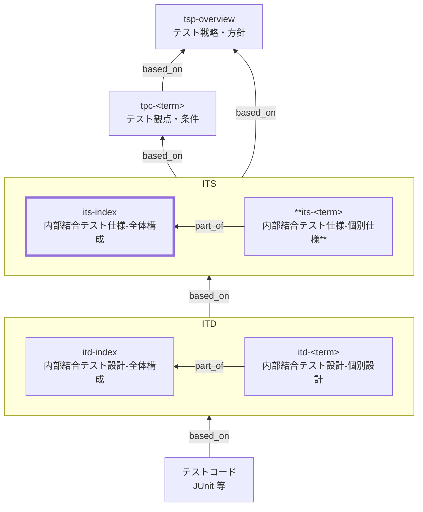

Internal Integration Test Specification Index (ITS Index) Documentation Rules

本ドキュメントは、内部結合テスト仕様のうち **全体構成（`its-index`）** を統一形式で記述するための標準ルールです。
`its-index` は、上位仕様（TSP/TPC 等）で整理された観点・条件を「内部結合（システム内部の連携）」の責務として解釈し、個別の内部結合テスト仕様（`its-<term>`）へ分配するための **入口（ナビゲーション）** になります。

ITS は「テストコード」ではありません。
また ITS は「個別のテスト手順書」でもなく、**内部連携の観点で何を保証するか（What）** を明確にする文書です。

---

## 1. 全体方針

- `its-index` は内部結合（自組織管理の内部コンテナ／コンポーネント間）で **何をどこまで保証するか** を示し、個別 `its-<term>` への入口（ナビゲーション）となる。
- 扱うのは **方針・基準・分配・ナビゲーション** まで。詳細条件・ケース・手順は ITD など下位で展開する。
- 外部システムとの結合は ETS へ分離し、上位方針（TSP/TPC）と整合させ、根拠は Frontmatter の `based_on` で追跡する。
- 記述は曖昧さを排し、**入力／連携点／期待結果／観測点** で表現する。クリック手順や実装詳細（SQL全文・物理カラム・内部クラス/関数・特定ライブラリ設定）は書かない。
- 代表条件は本書に置き、具体値・網羅ケース・データ準備手順は下位設計に委ねる。

## 2. 位置づけ / 用語定義

### 2.1. 位置づけ

`utd-<term>`と他ドキュメントの関係を以下に示します。



### 2.2. 用語定義

| 用語       | 定義                                                                 |
| ---------- | -------------------------------------------------------------------- |
| ITS        | 内部結合テスト仕様。システム内部の連携で保証する範囲を定義する文書   |
| 内部結合   | 自組織が管理するシステム境界内のコンテナ／コンポーネント間連携       |
| 連携点     | I/F境界（API、メッセージ、DBアクセス（論理）、ファイル（内部）等）   |
| テスト対象 | 内部連携に関与する成果物（画面、API、バッチ、キュー等）              |
| 観測点     | 合否判定の根拠となる観測箇所（レスポンス、ログ、DB状態、イベント等） |

## 3. ファイル命名・ID規則

- 本ドキュメント（全体構成）の `id` は `its-index` 固定とします。
- 個別仕様は `its-<term>` とします（例: `its-order-api`, `its-inventory-api`）。
- ファイル名はプロジェクト内で一意になるように命名します。
  - 例: `its-010-内部結合テスト仕様-全体構成.md`
  - 例: `its-020-内部結合テスト仕様-order-api.md`

## 4. 推奨 Frontmatter 項目

Frontmatter は共通スキーマに従います（あわせてメタ情報ルールも参照）。

- 参照スキーマ: [docs/shared/schemas/spec-frontmatter.schema.yaml](../../../shared/schemas/spec-frontmatter.schema.yaml)
- メタ情報ルール: [meta-document-metadata-rules.md](meta-document-metadata-rules.md)

| 項目       | 説明                                                    | 必須         |
| ---------- | ------------------------------------------------------- | ------------ |
| id         | ITS ID（`its-...`）                                     | ○            |
| type       | `test` 固定                                             | ○            |
| title      | 仕様名（例: 内部結合テスト仕様: 在庫）                  | ○            |
| status     | `draft` / `ready` / `deprecated`                        | ○            |
| part_of    | 集約ドキュメントへの所属（個別仕様は `its-index`）      | 任意         |
| based_on   | 根拠となる仕様ID（TPC/NFR/SAC/BAC/EAPIS/UIS/BR/ADR 等） | 任意（推奨） |
| supersedes | 置き換え関係                                            | 任意         |

推奨:

- `based_on` には最低限、関連する `tpc-...` を含めます。
  - ここで求めるのは **網羅的な列挙ではなく、追跡の起点となる一次参照**です。
  - BAC/NFR/BR 等は、ITS の方針判断（境界・パターン・観点・共通合格基準）に **直接利用したものだけ**を列挙します（大量になる場合は TPC 側のトレース表に集約）。
- 可能であれば、試験戦略/方針の上位文書（例: `tsp-overview`）も `based_on` に含めます。
- `part_of` / `based_on` / `supersedes` は ID 配列で記載し、未指定の場合も `[]` として明示してよいです。

## 5. 本文構成（標準テンプレ）

`its-index` は以下の見出し構成を **必ず守ります**（順序固定）。

1. 概要
2. 対象スコープと連携境界
3. 連携パターン一覧
4. 保証範囲（観点）
5. テスト条件（代表条件）
6. 合格基準とエビデンス
7. 個別仕様一覧（統合表）
8. 対象外 / 除外理由
9. メモ / 将来課題

補足:

- 個別 ITS（`its-<term>`）は、上記テンプレを基本にしつつ、対象範囲をその連携に限定して記載します。
- 個別 ITS が肥大化する場合は、`its-<term>` を連携対象（例: `order-api`, `inventory-api`）で分割し、`part_of` で `its-index` への所属を明示します。

## 6. 記述ガイド

### 6.1. 概要

- 1〜3文で「どの内部連携を、何のために保証するか」を書きます。
- 可能なら対象仕様（BAC/NFR/主要機能）に言及し、`based_on` と整合させます。

### 6.2. 対象スコープと連携境界（必須）

「内部結合でどこまで実体連携するか」を明確にします。

推奨（表）:

| 項目       | 内容例                                               |
| ---------- | ---------------------------------------------------- |
| 対象範囲   | UI↔API、API↔Domain、API↔DB（論理）                |
| 対象成果物 | 画面（UIS）、API（EAPIS）、バッチ                    |
| 連携点     | REST、メッセージ、内部イベント、内部テーブル（論理） |
| 依存の扱い | 外部はスタブ、内部は実接続（原則）                   |
| 観測点     | レスポンス、イベント発行、DB状態、ログ               |

記述のコツ:

- DBは「物理テーブル名」を書かず、**データストア（概念）や業務データ辞書の用語**で記述します。

### 6.3. 連携パターン一覧（必須）

内部結合で押さえるべき連携パターンを列挙します（ケースの羅列ではない）。

推奨（表）:

| パターンID | 呼称     | 連携元 → 連携先              | 連携点         | 目的                 |
| ---------- | -------- | ---------------------------- | -------------- | -------------------- |
| IIT-01     | 在庫引当 | Order API → Inventory Domain | API呼出        | 注文確定時に在庫引当 |
| IIT-02     | 状態更新 | Domain → Data Store          | 永続化（論理） | 状態を記録する       |
| IIT-03     | 内部通知 | Domain → Internal Event      | メッセージ     | 下流へ通知           |

### 6.4. 保証範囲（観点）（必須）

「内部結合で何を保証するか」を観点として整理します。

推奨カラム:

| 観点ID | 観点分類 | 観点名    | 保証内容                                          | 根拠    |
| ------ | -------- | --------- | ------------------------------------------------- | ------- |
| II-01  | 正常     | 連携成功  | 正しい入力で連携が成立し、期待する出力/状態になる | TPC-xx  |
| II-02  | 例外     | 入力不正  | バリデーションで拒否され、状態が汚れない          | BR-xx   |
| II-03  | 例外     | 依存障害  | 内部依存が失敗した場合の扱いが仕様通り            | SAC-xx  |
| II-04  | 状態     | 状態遷移  | 状態依存分岐が正しく、遷移が正しい                | CSTD-xx |
| II-05  | 非機能   | 監査/ログ | 監査ログが必要箇所で残る                          | NFR-xx  |

### 6.5. テスト条件（代表条件）（必須）

具体的な値や手順は下位の設計（例: ITD）へ委ねつつ、代表条件を示します。

補足（推奨）:

- 代表条件は、**観点（保証）× 条件（状態）→ 期待結果** の形で「何を、どの状態で、どうなるべきか」が読める粒度にします。
- 「×」は網羅的な直積（全組合せ）の意味ではありません。必要条件を選び、重要度に基づき代表条件を置きます。

| 観点ID | 条件ID | 条件（状態レベル） | 期待結果（方向性）                |
| ------ | ------ | ------------------ | --------------------------------- |
| II-01  | IC-01  | 正常入力で注文確定 | 在庫引当→状態更新→応答OK          |
| II-02  | IC-05  | 必須項目欠落       | 400/エラー、状態変更なし          |
| II-03  | IC-08  | 内部依存が失敗     | リトライ/ロールバック等が仕様通り |

### 6.6. 合格基準とエビデンス（必須）

| 項目         | 合格基準（例）         | エビデンス   |
| ------------ | ---------------------- | ------------ |
| 実行結果     | 失敗0件                | CIレポート   |
| 重要観点     | Highの観点が全て実施済 | 実施記録     |
| 未解決不具合 | Critical 0             | 不具合管理票 |

### 6.7. 個別仕様一覧（統合表）（必須）

運用上の更新漏れを防ぐために、**個別 ITS（`its-<term>`）の対象・境界・対応する観点/パターン・リンクを 1 表に統合**し、ここを単一ソース（Single Source of Truth）とします。

推奨の表（例）:

| `its-<term>`                               | 対象の要約（連携境界）          | 対応パターン（例） | 対応観点（例）    | 根拠（一次参照） | コメント |
| ------------------------------------------ | ------------------------------- | ------------------ | ----------------- | ---------------- | -------- |
| [its-order-api](./its-index-rules.md)      | Order API ↔ Inventory Domain   | IIT-01             | II-01/II-02/II-03 | `tpc-sale-*`     |          |
| [its-order-db](./its-index-rules.md)       | Order API ↔ Data Store（論理） | IIT-02             | II-01/II-04/II-05 | `tpc-order-*`    |          |
| [its-internal-event](./its-index-rules.md) | Domain ↔ Internal Event        | IIT-03             | II-01/II-03/II-05 | `tpc-event-*`    |          |

※ 本ルール文書ではデッドリンク防止のため、例のリンクを本ファイル（自己参照）にしています。
※ 実運用では、各 `its-<term>` が指す個別仕様ファイル（例: `./its-<term>.md`）へリンクしてください（実ファイル名・配置はプロジェクトに合わせます）。

### 6.8. 対象外 / 除外理由（必須）

例:

- 外部サービス自体のSLA（外部契約に委ねる）→ ETSへ
- 性能のピーク検証 → NFR試験へ

### 6.9. メモ / 将来課題

- 未確定のIF（API変更予定など）
- 将来追加する結合パターン

## 7. 禁止事項

| 項目                               | 理由                                          |
| ---------------------------------- | --------------------------------------------- |
| SQL全文、物理テーブル/物理カラム名 | 実装依存で変更に弱い                          |
| 内部クラス/関数名の列挙            | 実装依存で変更に弱い                          |
| クリック手順の逐語列挙             | UI変更に弱い                                  |
| 個別ケースの大量列挙               | ITD/実装に分解すべき                          |
| 「十分」「適切」等の曖昧表現       | 合否判定不能                                  |
| 未定義のメタ情報プロパティ追加     | スキーマ違反（`additionalProperties: false`） |

## 8. サンプル（最小）

### 8.1. メタ情報（Frontmatter）

```yaml
---
id: its-index
type: test
title: 内部結合テスト仕様: 全体
status: draft
part_of: []
based_on:
  - tsp-overview
  - tpc-order-process
supersedes: []
---
```

### 8.2. 概要

本ドキュメント（`its-index`）は、内部結合（システム内部の連携）で担保する **スコープ・境界・連携パターン・観点・代表条件・共通合格基準** を定義し、個別 ITS（`its-<term>`）へ分配する入口（ナビゲーション）とする。

### 8.3. 対象スコープと連携境界

| 項目       | 内容例                                               |
| ---------- | ---------------------------------------------------- |
| 対象範囲   | UI↔API、API↔Domain、API↔DB（論理）                |
| 連携点     | REST、メッセージ、内部イベント、内部テーブル（論理） |
| 依存の扱い | 外部はスタブ、内部は実接続（原則）                   |
| 観測点     | レスポンス、イベント発行、DB状態、ログ               |

### 8.4. 連携パターン一覧

| パターンID | 呼称     | 連携元 → 連携先              | 連携点  | 目的                 |
| ---------- | -------- | ---------------------------- | ------- | -------------------- |
| IIT-01     | 在庫引当 | Order API → Inventory Domain | API呼出 | 注文確定時に在庫引当 |

### 8.5. 保証範囲（観点）

| 観点ID | 観点分類 | 観点名   | 保証内容                                          | 根拠   |
| ------ | -------- | -------- | ------------------------------------------------- | ------ |
| II-01  | 正常     | 連携成功 | 正しい入力で連携が成立し、期待する出力/状態になる | TPC-xx |

### 8.6. テスト条件（代表条件）

| 観点ID | 条件ID | 条件（状態レベル） | 期待結果（方向性） |
| ------ | ------ | ------------------ | ------------------ |
| II-01  | IC-01  | 正常入力で注文確定 | 在庫引当→応答OK    |

### 8.7. 合格基準とエビデンス

| 項目     | 合格基準（例） | エビデンス |
| -------- | -------------- | ---------- |
| 実行結果 | 失敗0件        | CIレポート |

### 8.8. 個別仕様一覧（統合表）

| `its-<term>`                          | 対象の要約（連携境界）        | 対応パターン | 対応観点          | 根拠（一次参照） | コメント |
| ------------------------------------- | ----------------------------- | ------------ | ----------------- | ---------------- | -------- |
| [its-order-api](./its-index-rules.md) | Order API ↔ Inventory Domain | IIT-01       | II-01/II-02/II-03 | `tpc-sale-*`     |          |

※ 本サンプルではデッドリンク防止のため、例のリンクを本ファイル（自己参照）にしています。実運用では各 `its-<term>` の個別仕様ファイルへリンクしてください。

## 9. 生成 AI への指示テンプレート

生成 AI に `its-index` を作らせるときの指示テンプレートは [its-instruction.md](../instructions/its-instruction.md) を参照してください。
