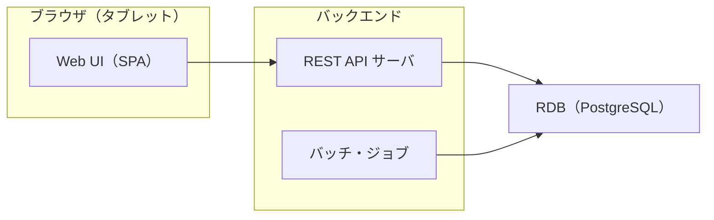

# C4 コンテナ図

```mermaid
flowchart LR
  subgraph Browser["ブラウザ（タブレット）"]
    WebUI["Web UI（SPA）"]
  end

  subgraph Backend["バックエンド"]
    API["REST API サーバ"]
    Job["バッチ・ジョブ"]
  end

  DB["RDB（PostgreSQL）"]

  WebUI --> API
  API --> DB
  Job --> DB
```
