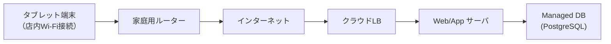

# インフラ構成概要

```mermaid
flowchart LR
  UserDevice["タブレット端末\n（店内Wi-Fi接続）"]
  Internet["インターネット"]
  Router["家庭用ルーター"]
  CloudLB["クラウドLB"]
  WebApp["Web/App サーバ"]
  DB["Managed DB\n(PostgreSQL)"]

  UserDevice --> Router --> Internet --> CloudLB --> WebApp --> DB
```
