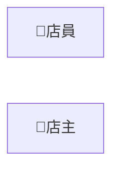
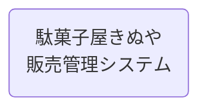
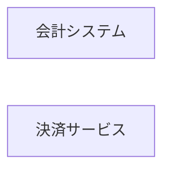
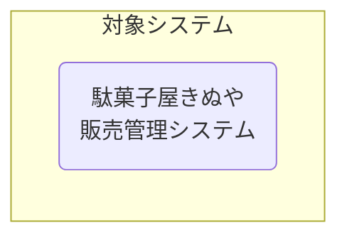
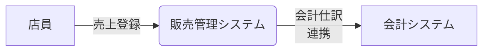
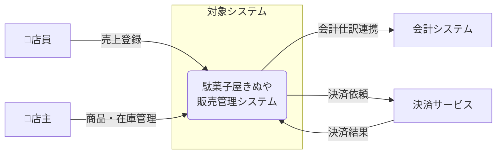
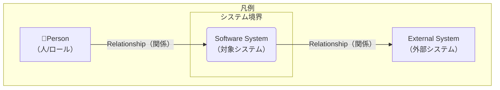

# Mermaid を用いたC4コンテキスト図（C4 Context Diagram: CXD）作成ルール

本ドキュメントは、アーキテクチャ設計のために、**Mermaid の `flowchart` 構文を使って C4 コンテキスト図（システムコンテキスト）を描く際の標準ルール**です。

C4 コンテキスト図は「対象システム」と、その周辺の **利用者（人）**・**外部システム**・**関係（やり取り）**を、概念レベルで合意するために用います。

---

## 1. 全体方針

- Mermaid の **`flowchart` を C4 コンテキスト図風に利用**する。
- 対象は「システム境界の外側との関係」であり、内部構造（コンテナ/コンポーネント）や実装詳細は含めない。
- 図は「正確さ（過剰な詳細）」よりも「解釈が割れないこと（合意）」を優先する。
- 1つの図には **対象システムを1つ**だけ置く（複数対象は図を分ける）。

---

## 2. C4要素と Mermaid 記号の対応

C4 の要素を、以下のように Mermaid の記号にマッピングする。

| C4要素                                   | 意味                       | Mermaid での表現例                                       |
| ---------------------------------------- | -------------------------- | -------------------------------------------------------- |
| Person（人/ロール）                      | 利用者・関係者             | `店員["店員"]`                                           |
| Software System（対象システム）          | この図の中心となるシステム | `販売管理システム("駄菓子屋きぬや 販売管理システム")` |
| External Software System（外部システム） | 連携先システム             | `会計システム["会計システム"]`                           |
| System Boundary（境界）                  | 対象システムの範囲         | `subgraph 境界["対象システム"] ... end`                  |
| Relationship（関係）                     | 依存・利用・連携（概念）   | `店員 --> \| "売上登録" \| 販売管理システム`             |

---

## 3. ノードのルール

### 3.1 Person（人/ロール）

- **四角 `[]`** を使用する。
- 表示ラベルは業務ロール/主体を短い日本語で表す。

例:

### 3.2 Software System（対象システム）

- **角丸長方形 `()`** を使用する。
- 図の中心として扱い、表示ラベルは「システム名（＋必要なら短い補足）」とする。
- 改行は ` ` を使用してよい（長文化防止）。

例:

### 3.3 External Software System（外部システム）

- **四角 `[]`** を使用する。
- 表示ラベルは外部システムの一般名（例: 決済、会計、EC、配送など）。

例:

### 3.4 System Boundary（境界）

- 対象システムは **サブグラフ `subgraph ... end`** で囲う。
- 境界内には、原則として **対象システムのノード1つ**だけを置く（コンテキスト図の過密化防止）。

例:

---

## 4. エッジ（関係）のルール

### 4.1 方向

- `A --> B` を基本とする。
- 方向は「主たる依存/利用/送信の向き」が分かるように統一する。
  - 例: 人がシステムを利用する: `人 -->|"利用"| 対象システム`
  - 例: 対象システムが外部システムに連携する: `対象システム -->|"連携"| 外部システム`

### 4.2 ラベル

- すべてのエッジにラベルを付ける（「何の関係か」を合意するため）。
- ラベルは **短い名詞句**または **短い動詞句**で書く。
  - 例: `売上登録` / `在庫照会` / `仕入データ連携` / `入金結果を受信`
- 長い場合は ` ` で改行してよい。

例:

---

## 5. 命名・表記ルール

- ノードIDは日本語でもよいが、記号や空白は避け、短い識別子にする（例: `販売管理システム`, `会計システム`, `店員`）。
- 表示ラベルは `"..."` で囲ってよい（混乱を避けるため、必要に応じて統一）。
- 同じ主体/システムは、図の中で名称を揺らさない。

---

## 6. 禁止事項

| 項目                                                  | 理由                              |
| ----------------------------------------------------- | --------------------------------- |
| 物理テーブル名・物理カラム名・SQL全文                 | コンテキスト図の粒度を超える      |
| APIエンドポイント/HTTPメソッド/リクエストJSON等の詳細 | IF仕様に記述する                  |
| 実装クラス/関数名、具体的な技術スタックの列挙         | 変更に弱い                        |
| 対象システムの内部プロセス/内部データストアの詳細     | コンテナ図/コンポーネント図で表す |
| 矢印ラベルなしの関係                                  | 合意が取れない                    |

---

## 7. サンプル（最小）

---

## 8. 凡例（推奨）

凡例は下記のように表現する（必要な場合のみ）。

---

## 9. 生成 AI への指示テンプレート

生成 AI に C4 コンテキスト図を作らせるときは、以下のような指示を与える。

> - Mermaid の `flowchart` 構文を使って、C4コンテキスト図（システムコンテキスト）を作成してください。
> - 図の中心となる **対象システムは1つ**にしてください。
> - 対象システムは `subgraph ... end` で囲い、境界内には原則として対象システムのノード1つだけを置いてください。
> - Person（人/ロール）と External Software System（外部システム）を必ず含めてください（該当がない場合は理由を明記）。
> - 関係は `-->` で表現し、**すべての矢印にラベル**（短い日本語）を付けてください。
> - 禁止: 物理テーブル名・カラム名・SQL全文、APIエンドポイントやHTTP詳細、実装クラス/関数名、対象システム内部の詳細プロセス/データストア
> - 結果は `\`\`\`mermaid ... \`\`\` ` のコードブロックとして出力してください。
