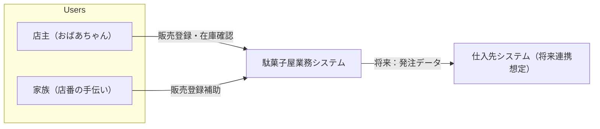
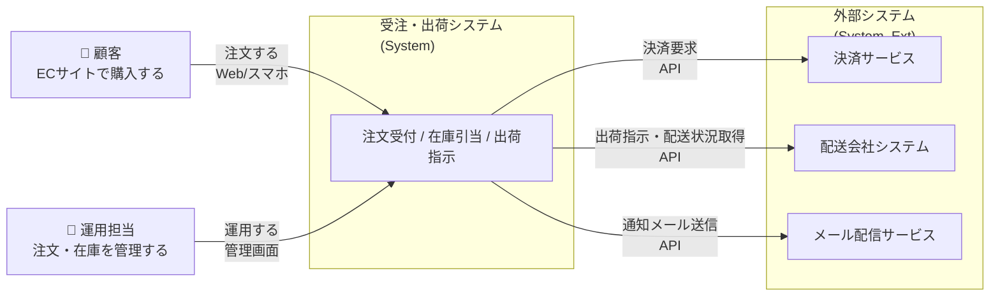

# C4 コンテキスト図

```mermaid
flowchart LR
  subgraph Users
    Grandma["店主（おばあちゃん）"]
    Family["家族（店番の手伝い）"]
  end

  System["駄菓子屋業務システム"]
  ExtSupplier["仕入先システム（将来連携想定）"]

  Grandma -->|販売登録・在庫確認| System
  Family -->|販売登録補助| System
  System -->|将来：発注データ| ExtSupplier
```

```mermaid
flowchart LR
  %% ========== People ==========
  customer["👤 顧客<br/>ECサイトで購入する"]
  admin["👤 運用担当<br/>注文・在庫を管理する"]

  %% ========== System of Interest ==========
  subgraph S["受注・出荷システム<br/>(System)"]
    system["注文受付 / 在庫引当 / 出荷指示"]
  end

  %% ========== External Systems ==========
  subgraph E["外部システム<br/>(System_Ext)"]
    pay["決済サービス"]
    ship["配送会社システム"]
    mail["メール配信サービス"]
  end

  %% ========== Relationships ==========
  customer -->|注文する<br/>Web/スマホ| system
  admin -->|運用する<br/>管理画面| system

  system -->|決済要求<br/>API| pay
  system -->|出荷指示・配送状況取得<br/>API| ship
  system -->|通知メール送信<br/>API| mail

  %% ========== Styles (C4っぽく見せる) ==========
  classDef person fill:#fff,stroke:#333,stroke-width:1px;
  classDef system fill:#e7f3ff,stroke:#1b66c9,stroke-width:2px;
  classDef external fill:#fff3e6,stroke:#c96b1b,stroke-width:1px;

  %% class customer,admin person
  %% class system system
  %%class pay,ship,mail external
```
