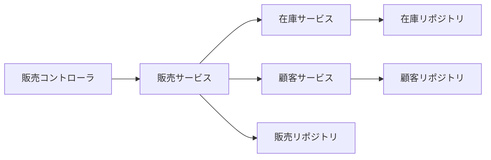

# C4 コンポーネント図（APIサーバ内）

```mermaid
flowchart LR
  Controller["販売コントローラ"]
  StockService["在庫サービス"]
  SalesService["販売サービス"]
  CustomerService["顧客サービス"]
  StockRepo["在庫リポジトリ"]
  SalesRepo["販売リポジトリ"]
  CustomerRepo["顧客リポジトリ"]

  Controller --> SalesService
  SalesService --> StockService
  SalesService --> CustomerService
  StockService --> StockRepo
  SalesService --> SalesRepo
  CustomerService --> CustomerRepo
```
